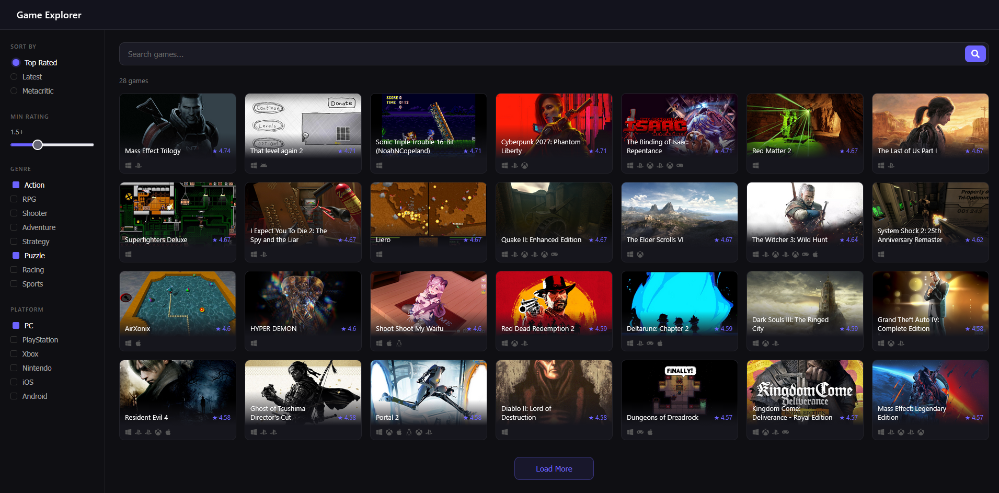

# Game Explorer

A React application for browsing and searching video games using the [RAWG API](https://rawg.io/apidocs).

## Live Demo

[game-explorer-git-main-xtekkis-dev.vercel.app](https://game-explorer-git-main-xtekkis-dev.vercel.app)

## Preview

## Features

- Browse top rated games
- Search games by name
- Filter by genre, platform and minimum rating
- Sort by top rated, latest or metacritic score
- Load more pagination
- Skeleton loading cards with shimmer effect
- Click any game to view details
- Dynamic browser tab titles per page
- Search and genre state persist in the URL
- Fully responsive with burger menu on mobile and tablet

## Tech Stack

- React 19
- Vite
- React Router DOM
- React Icons
- RAWG Video Games Database API
- Deployed on Vercel

## Getting Started

1. Clone the repository
2. Install dependencies with `npm install`
3. Create a `.env` file in the root with your RAWG API key:
   `VITE_RAWG_API_KEY=your_api_key_here`
4. Run the development server with `npm run dev`